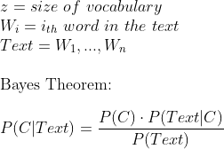
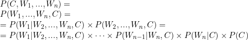
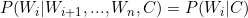
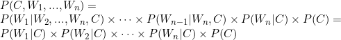
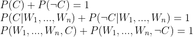
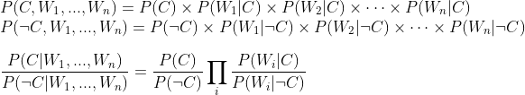
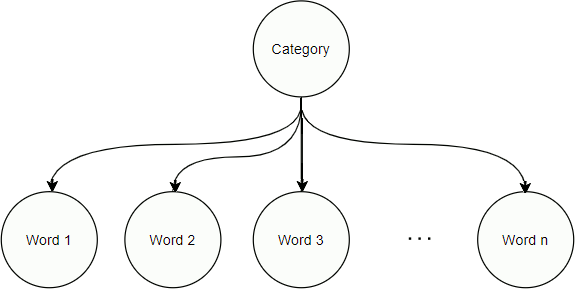
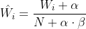
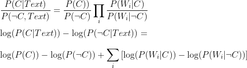

# **DANIELE DOMENICHELLI - UNIBO** 
## **FOUNDAMENTALS of ARTIFICIAL INTELLIGENCE and KNOWLEDGE REPRESENTATION - PROJECT:**
## *Developing a simple Naive Bayesian Network Classifier for detecting social media and news paper immigration opinion (Italian language)*

## Index:
1. [Introduction](#1-introduction)
2. [Data Mining](#2-data-processing)
    1. [Entries](#21-entries)
    2. [Classification](#22-classification)
    3. [Validation](#23-validation)
3. [Bayesian Network](#3-bayesian-network)
    1. [Model Topology](#31-model-topology)
    2. [Text Classifier Interface](#32-text-classifier-interface)
    3. [Graph Model (pgmpy)](#33-graph-model-pgmpy)
    4. [Simplified Table Model](#34-simplified-table-model)
4. [Software Requirements](#4-software-requirements)
5. [Comparisons, Remakrs, Conclusions](#5-comparisons-remarks-conclusions)

## 1 Introduction:
The project was born from the needings of some collegues of Sociology University of Macerata (UniMC) to collect and extract informations from articles and social media in order to percieve the differences of opinions about immigration in those means. All the articles explored are in Italian language due to the purpose of sociologist thesis.

The aim of this work is to explore and illustrate how the Probabilistic Graphical Model (graph based network) beahavies and perform with a huge ammount of data and relations, such as the text classification, and offer a different approach to it.

The initial project was programmed in `NodeJS`, but for the purpose of the studied case, it had been converted in `Python`. For this reason the model exploration was not linear, I have tried to implement the same network built in the sociology project, but with the suggested [pgmpy](https://pgmpy.org/) python library.

[Back to Index](#index)

## 2 Data Collection:
The data collection 

[Back to Index](#index)
The data collection was led over a set of hosts through a dedicated web crawler, which explores articles, posts and tweets present in a web service. In particular a search of the word _"immigrazione"_ (immigration) was performed over the internal search engines of each host, using the exposed API of the service where present (expecially in social medias).

The hosts are:
- La Repubblica _(newspaper)_
- Il Corriere _(newspaper)_
- Il Sole 24 ore _(newspaper)_
- Facebook _(social media)_
- Tweetter _(social media)_

### 2.1 Entries

Every article, post or tweet is then processed to take the shape of an `entry`: each of them will store the source or host of the content, the date when it was publicated, a textual representation of the content (removing any markup language or non valid character from the corpe) and, when available, a short description called title. Each `entry` is then processed to obtain data usefull in the next steps of the analysis.

```
Entry = {
    --- article / post / tweet data --- 
    source: string
    date:   date-time
    text:   string
    title:  string
    
    --- extrapolated data ---
    tokens: array<string>
    frequency table: map<string - int>
    score: int
    category: string
}
```
Anytime, the word `entry` will refer to this kind of data structure.

The text will be then processed and tokenized, removing invalid or special characters and dividing words into tokens by splitting them with spaces.

Further analysis of the dataset were applied, but only those related to this work, useful to understand the chosen process, are reported.

[Back to Index](#index)

## 2.2 Classification
In order to understand the opinion from the `entry` body text, a first division was made by looking for certain keywords or keyphrases in the full text, giving a predetermined score:
- `Positive`: any behaviour that favours social inclusion of immigrants
- `Negative`: any behaviour that is ostile or disfavours any immigrant activity
- `Neutral`: none of the two precendent categories

Each positive word or sentence found will give `+1` point to the final score, while a negative one will give `-1` point. At the end, a positive sum will fall into the `positive` category, a negative in the `negative` one, a strictly `0` sum will fall into the `neutral` category.

From these three categories were extrapolated two types of dataset: a `neutral dataset` containing any category of `entry`, and a `direct dataset` containing just not neutral content. This division was adopted to deeply analyze the interesting content, because just about the `3%` of the whole dataset fell into the `direct dataset`.

[Back to Index](#index)

## 2.3 Validation
In order to ensure the validity of this classification, a sample of `1000 entries`, chosen with opportune criteria, were controlled by the sociologists in order to find out if some of them unintentionally misled the informations and the classification toward any particular direction. An accuracy of `89.2%` was measured in the final evaluation _(almost `9/10 entries` were successfully classified)_.

[Back to Index](#index)

## 3 Bayesian Network:
A Bayesian Network is a Probabilistic Graphical Model representing the relations between a set of random variables, usually using a graph model to represent them. Each node stores a random variable, while each edge represents the relation of dependency between two of them.

In particular a Bayesian Network is an acyclic graph: there are no interdependant random variables, such that any node is not dependent from any of its ancestors. Each event is then represented by a single random variable, so it is stored in a node. Each node contains the probability table of its variable given the values of its parents (`P(V|Parents)`). This graphical model can better highlight which events are dependant or independant, describing the causality between them.

It sounds a nice idea to extract the probability to find certain words or sentences inside a text body, so it is possible to build a probabilistic model based on the presence of certain tokens. The full set of the tokens in the dataset is called vocabulary. The problem is that building such a model for all the possible sentences in the full dataset is as expensive as impossible to afford. Each word can create a _(not always compute)_ sentence with any of the other words in the whole dataset, and this means that the model will grow at least exponentially with the size of the vocabulary.

**Bayes Model**



`P(Text)` is constant and we are interested in `P(C)`, so we need just to compute `P(C, W1, ..., Wn)`

Exploiting the joint probability and the chain rule:



but since the number of these operations is proportional to `O(z^2)` this will have an unaffordable computation time.

**Naive Bayesian Network**

The first possible semplification is to eliminate interdependency between words. This means that the model describe the text and any permutation of it at the same way: _"Thomas Bayes was a mathematician"_ and _"mathematician was Bayes a Thomas"_ are modelled as the same way, beyond the correctness of the sentence, giving the same probability to belong to a certain category. This model insight is that no matter if the events are structured _(in time or space for example)_, it just metters how much they occur.

The model that uses this semplification takes the name of Naive Bayesian Network. The difference with the normal Bayesian Network is that any node in the graph cannot share any descendant with the others, or, in other words, given two nodes there are no intersecting path connecting them, where an intersection is a node shared between two paths _(excluding initial and final nodes)_. 

**Naive Bayes Model**

To the previous equations we can add the interindependency (or conditional independence assumption) of the events such that:



This completely boils down our previous equation to



The current number of operations become just `O(z)`, pretty affordable even with huge number of `z`.

**Naive Bayesian Network for Classification**

At this point, it is possible to express the previous probability in term of a series of likelihood ratios:





It is now easy to see that a certain text belongs to the category `C` if the ratio is greater (or equal) than `1`. The probability to belong to a certain category `C` is given by the ammount of events (`entries` in this case) labeled in the dataset, while that of not belonging to `C` is just the complementary of the first, `1 - P(C)`. The algorithm is just left to calculate the probability to belong to that category at the posterior of the word `Wi` occuring.

[Back to Index](#index)

### 3.1 Model Topology
It is important to understand how the model builds up while classifying a text:

It starts with the category node. After each word is added to the model, new nodes become parents of the category node, inserting a new row in its table. At the end, the category node table will store the probability of each word in the vocabulary to belong to a certain category.




**Category Node Table**
|            | Probability |
| ---------- |:-----------:|
| Category 1 |    15%      |
| Category 2 |     7%      |
| ...        |    ...      |
| Category k |    11%      |


**Word Node Table**
|         | Category 1 | ... | Category k |
| ------- |:----------:|:---:|:----------:|
| Word i  |     15%    | ... |     7%     |

As shown in the word nodes, the table will store just the probability of the word to appear in a generic text. Since we are just interested in inserting a given text into the most probable category, we can ignore any word node table.

### 3.2 Text Classifier Interface:
In order to compare different models, it was defined an interface describing the task that the classifier should do over the data:

```python
# Abstract class of a Text Classifier
class TextClassifier:
    # return the probability of a given token to belong a given category:
    # P(W1 | C)
    def token_probability(self, token: str, category: str) -> float: pass

    # return the probability of the given category:
    # P(C)
    def category_probability(self, category: str) -> float: pass

    # retrive the probability table of the given text
    # without knowing the probability of the category (no prior evidence):
    # P(C | W1, ..., Wn)
    def word_probability(self, text: str) -> DataFrame: pass

    # retrive the probability table of the given text
    # knowing the probability of categories (prior evidence):
    # P(C) * P(C | W1, ..., Wn)
    def probability(self, text: str) -> DataFrame: pass

    # retrive the most probable category of the given text,
    # using the unconditioned probability:
    # P(C | W1, ..., Wn)
    #
    # If categoryEvidence is set to True, it takes in account
    # the current probability to belong to a category:
    # P(C) * P(C | W1, ..., Wn)
    def predict(self, text: str, categoryEvidence=False) -> (str, float): pass

    # learn (or store) probabilities for tokens extracted by the given text(s) or document(s)
    def fit(self,
        text: Union[str, Iterable[str], Iterable[Data], DataFrame],
        category: Union[str, Iterable[str]]=None
    ) -> TextClassifier: pass

    # return a sorted by probability table with
    # tokens as rows and categories as columns,
    # for the given categories
    def words(self, categories: Union[str, Iterable[str]]) -> DataFrame: pass
```

In such way it is possible to abstract the process of elaborating the probability query to the underling implementation. This will be fundamental while switching from the `pgmpy graph model` to the `simplified table model` and viceversa.

[Back to Index](#index)

### 3.3 Graph Model (pgmpy):
The chosen implementation for the Probability Graphical Model used in this work is the [pgmpy](https://pgmpy.org/) library. This is one of the most broad and supported library for PGM models for python. It indeed supports the Naive Bayes Network.

In order to generate the model with the library, it is necessary to write every conditional probability distribution table (`TabularCPD`) by hand. This is quite easy when we are generating the table for the word node, because it is possible just to leave it with random values, as it doesn't contain any text classification information.

```python
word_i_cpd = TabularCPD(
    # calling variable as the token associated to the word
    variable = word_i_token,
    # variable cardinality: 2 <=> present/absent
    variable_card = 2,
    # filling probability values with initial uniform probability
    # these values will be tuned by the algorithm at learning time (fit)
    values = [ [0.5, ..., 0.5], [0.5, ..., 0.5] ],
    # associate the relation parent->child
    # from this node to the category node
    evidence=[category_token],
    # set the cardinality of the child node (number of categories)
    evidence_card=[category_number]
)
```

In the same way, defining the table of the category node is even simpler, because it isn't needed to specify relationships as parent node:
```python
category_cpd = TabularCPD(
    # a special unique token that define the category node
    variable = category_token,
    # number of categories
    variable_card = category_number,
    # these will be the values associated with entries statistics
    # they store the probability of a category
    # to get randomly extracted from the dataset
    values = [ [1/category_number, ..., 1/category_number] ]
)
```

Now all the defined CPDs must be inserted in the graph of the model and finally the graph integrity will be checked:

```python
model.add_cpds(word_1_cpd, word_2_cpd, ..., word_n_cpd, category_cpd)
model.check_model()
```

The fitting process is already defined by the library, the only needed operation is to reshape the tokens found in text into a boolean matrix of `0`s and `1`s, representing the presence/absence of the token in the content. Indeed `pgmpy fit` method needs as input a `pandas.DataFrame` matrix, with each row representing an `entry` and each column a token. Before feeding the model, it is mandatory to define all the tables related to the token found in the passed dataset, and rearrange the table relative to the category node, in order to define all the relations with the just inserted node.

> _"Anything that can possibly go wrong... Does."_
>
> <cite>**Edward Murphy**</cite>

This code worked perfectly on a tiny test set of hundreds of tokens. But while learning the real test set, composed by tens of thousands tokens, the model breaks down: `pgmpy` is not designed to build such a huge network. Every time a node is inserted, the model checks its validity and also if the insertion of that node will violate the graph rules.

The current implementation of the library has a node insertion complexity proportional to `O(n^2)`, where `n` is the number of the already inserted nodes. This complexity is undetectable for tiny models even if they are complex. But a simple network, like the one described before, is unaffordable with a large dimension of the dataset.

Even after passing the long time of the learning, the model is completely unusable in a short period of time. The node visiting in an inference is also proportional to `O(n^2)`, so any query passed to the network will take almost the same time of the last steps of the learning process.

The `pgmpy`'s designer decided to give the most flexibility of the model in order to build complex systems but sacrificing its efficency. Unluckly this library is totally unaware of the simplicity of described model and it cannot perform any type of semplification over it.

[Back to Index](#index)

## 3.4 Simplified Table Model:
In view of the slowness of the `graph model` it is possible to build a `table model` out of the previous described network.

The table will contains three metadata to track the global statistics regarding the learnt `entries` and all the probability data associated with each token of those, inserted as rows and columns.

The first pythonic implementation made use of a `list` to store sighted tokens and a `numpy` array to store the whole probability distribuition of tokens over categories. Even this modality resulted into a very slow training model, but at least, once learnt the full dataset, at the test time was really fast. Analyzing the bottleneck of the program, it was found that looking for the presence of the token in the `list` is linear, but still too slow; also appending rows or columns to a `numpy` array is not efficient, inducing the whole system to be slow.

Inspired by the `NodeJS` implementation, the tokens and the probabilities are stored in a simple `dict`. This data structure makes use of hashes to access underling array containing data. Computing the hash and accessing (read/write) the `dict` value of the given token have a constant complexity `O(1)`. The resultant system is more than `100` times faster then the first implementation and more than `2000` times faster than the `pgmpy graph model`. Still, the `python dict` is not a real lookup table, since when the interpreter tries to access a key location, it does not just compute the hash, but it ensures the accessing key object equals the table key object. For this reason the time is not really constant, but rather is `Ω(s)`, where `s` is the biggest hash colliding token length, in the worst case. Despite this slows down the algorithm, it always prevents the hash collision problem, giving a great speed improvement nevertheless.

In addition, it was possible to optimize some operations specifically for a text classifier:

- **Out Of Voucabulary (OOV)**

    Some tokens in the test set weren't present in the training set. For the `graph model` this would mean to add a node and check again all the already inserted nodes in the graph, that is a long ride because of the squared time complexity of the insertion. For the `table model` it is just needed to compute the hash of the token and check it in the `dict` table, if not present `0` occurencies are reported, otherwise the `dict` values table contains the occurencies to report.

- **Laplacian Additive Smoothing Rule**

    The _**Add-One Smoothing**_ or _**Laplacian Smoothing**_, a general case of the _**Lidstone Smoothing**_, is a pseudocount technique, based on the _rule of succession_, used to smooth categorical data. Expecially, this rule applies when a prior knowledge on the problem completely biases the outcome of the probability estimation, due to previous observations. The smooth, in the text classification context, applies in all of those sentences where there is a strong presence of a word appartaining to one class, when most of the other words are not previously seen in a class: suppose the probabilistic classifier learnt to classify the kind of a book. When it will be feed by a document, containing the sentence _"The first in history to make extensive use of mathematics were the Greeks"_, it will find the word _"history"_ that was never previously seen, so it does not generate any weight for this classification; but it is still probable that the word _"history"_ is contained in a maths book, even if this word is rarely present in a maths book, in respect of other types of documents. As a remedy, each word is pseudocounted as already present in all the classifications, in order to smooth the probability of unknown tokens for all the classes. This technique is also useful during the potentially unsupervised trainings to prevent the _**confirmation bias**_ problems.

    

    `α` is the smoothing parameter, if `α = 0` no smoothing is applied (always taken strictly positive). In order to maintain the uniform distribution of the data `α` is usually taken as `1`. For this reason takes the name of _**Add-One Smoothing**_.

- **Log space probability**

    Since all the probability contributes of the words are numbers in the range `[0 - 1]` and the final probability is a weighted multiplication of them, it is likely probable to underflow the machine float capabilities, leading to `0` multiplication. This means that any time a word contribute is below the float minimal value of the machine it will floor the entire multiplication to `0`, even if in the text there are other very weighted words. A solution is to convert the probability contribution in the log space, so any multiplication is converted to an addition, more affordable for machine computations:

    


[Back to Index](#index)

## 4 Software Requirements:

The software requires:

- `python 3.x`
- `pandas >=1.x`
- `numpy >=1.x`
- `pgmpy >=0.1`

After installing [python 3](https://www.python.org/) it is possible to install all the dependencies by running the command

- *Pip users:*
    
    `pip install -r requirements.txt`
- *Conda users:*
    
    `conda install --file requirements.txt`

Notice that the project makes use of `python typing` annotations, make sure that your python interpreter implements them before use it _(usually standard installation of python 3.x does)_.

**NOTE:** _For space reason the `dataset` folder was compressed into a `zip` archive._
_Extract it to run or test the code!_

[Back to Index](#index)

## 5 Comparisons, Remarks, Conclusions

### **Comparisons**
After the full training over the dataset of both of the model, it was possible to compare them in term of time and space complexity.

**Time Complexity:**
| Model        | Training Direct Dataset | Training Neutral Dataset | Direct Test Time | Neutral Test Time |
|:------------:|:-----------------------:|:------------------------:|:----------------:|:-----------------:|
| pgmpy        |         4+ h            |       never completed    |  1 h / query  |   not calculated  |
| table `list` |       40 min            |        1 h 45 min        |  800 ms / query  |   8.7 s /query    |
| table `dict` |        6.5 s            |           8.9 s          |  120 ms / query  |   1.2 s / query  |

\
**Space Complexity:**
| Model | Direct Dataset | Neutral Dataset |
|:-----:|:--------------:|:---------------:|
| pgmpy |     3.7 MB     | never completed |
| table |     1.6 MB     |     8.4 MB      |

### **Remarks**

From the query results it is possible to infer that the most common words are _"di, e, il, la, per, in, del, a, che, i"_, those indeed occur each one more than `0.5%` of the entire vocabulary words, composed by nearby `41000` tokens.

Just by playing with elaborated output probabilities, we can infer that the following words are almost present only in a `positive`-like `entry`:

|  Word             |  ΔPositive / Total  |
|-------------------|:-------------------:|
|  soggiorno  		|        99.88%       |
|  permesso  		|        99.81%       |
|  rilascio  		|        99.76%       |
|  comma  			|        99.74%       |
|  colf  			|        99.69%       |
|  datore     	    |	     99.67%       |
|  lavoratore     	|	     99.63%       |
|  possesso  		|        99.61%       |
|  regolarizzazione |	     99.56%       |
|  procedura  		|        99.54%       |

\
While these words were found mostly in `negative` classified `entries`:

|  Word             |  ΔNegative / Total  |
|-------------------|:-------------------:|
| incontrollata     |        98.21%       |
| moscovici         | 		 90.93%       |
| scozia            | 		 90.93%       |
| fabrizia          | 		 88.41%       |
| sollievo          | 		 86.11%       |
| marcellofoa       | 		 85.12%       |
| byoblu            |        85.12%       |
| albertobagnai     |	     85.12%       |
| comunardo         | 		 85.12%       |
| edimburgo         |        83.98%       |

\
Another important remark is that the whole dataset was unbalanced, indeed the `negative entries` were slightly more than the `10%` of the whole set. This project was naively trained on a training set which maintened the distribution of the data, and then evaluated over a validation set, composed by the `5%` of the initial set, with the same distribuition. The final measured accuracy was `62.59%` for the `direct model` and `77.43%` for the `neutral model`; the `pgmpy model` accuracy was not measured due to the time needed for just one query _(nearby `53%` over `10` samples)_.

### **Conclusions**
After the whole work, it is possible to conclude that `pgmpy` was not meant to be used in text classification problems, due to the big dimension, granularity and interindependence of the data. The library still offers a good way to work with probabilistic models, mostly in a well known and defined space.

As stated by an author of the library in one [pgmpy github issue page](https://github.com/pgmpy/pgmpy/issues/1078)

> Since pgmpy uses multi-dimensional numpy arrays for representing CPDs, if a CPD has more than `32` variables (`31` parents) then you won't be able to use pgmpy
>
> _-- Khalibartan_

On the other hand, a lower level dedicated approach can be used to exploit a Naive Bayesian Network Model, predicting the opinion of a given text.

Anyway the probabilistic approach is hardly influenced by the _"past experience"_ over the training: it is possible to deduce from the `neutral model` accuracy, in respect of the `direct model` accuracy, that the more the dataset is unbalanced (more `neutral entries` then others) and the more the accuracy will raise, due to statistical effects.

In the end, probabilistic models tend to overfit the training dataset, and that leads to a very wide importance on its choice: the more the dataset represents the observed system the better will be the model.


[Back to Index](#index)